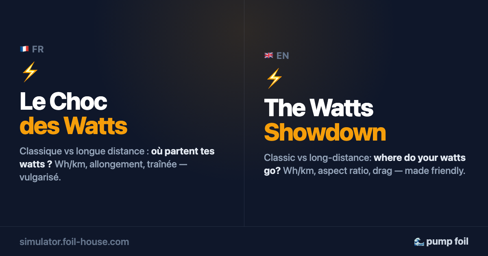

# ⚡ Le Choc des Watts — pump foil physics, made friendly

**👉 [simulator.foil-house.com](https://simulator.foil-house.com/)** · [English version](https://simulator.foil-house.com/?lang=en)

Four educational, single-file pages that answer the questions every pump foiler asks —
each one interactive, bilingual FR/EN, and honest about its numbers.

## The three pages

| Page | Question | What you get |
|---|---|---|
| **[⚡ Le Choc des Watts](https://simulator.foil-house.com/)** (home) | *How do I fly **far**?* | Compare two real wings (~30 presets) — watts, **Wh/km**, power-vs-speed chart, drag breakdown, sensitivity analysis. The secret: wide span + light weight. |
| **[🚀 La Course aux km/h](https://simulator.foil-house.com/vitesse.html)** | *How do I fly **fast**?* | Top-speed simulator (wing, profile, stab, mast, straps, your sprint watts), calibrated on real race speeds (30-38 km/h) and real race blades (AR ~10, ~11% thickness). Spoiler: the stab matters, and straps are the game changer. |
| **[🎓 Bien débuter](https://simulator.foil-house.com/debutant.html)** | *How do I **learn**?* | Safety first, dock start explained with honest expectations (5-15 sessions), and a weight-based setup recommender calibrated on school-range size charts — big thick wing, big stab, short mast: the setup that forgives. |
| **[🌊 Le Carve](https://simulator.foil-house.com/carve.html)** | *How do I **turn tight**?* | Maneuverability in the waves: roll inertia ∝ span², so a short span flips rail-to-rail fast. Compare wings (Axis Surge, Alpine RSX Carve…) on agility, drive and pivot. The price: short span kills glide. |

## The physics model (honesty first)

⚠️ **Estimated figures, not measurements** — wing profiles are kept secret by brands; the tool
gives **educational orders of magnitude** (± ~15%), not manufacturer values.

Steady flight (lift = weight), based on the
**[foilphysics](https://lsegessemann.github.io/foilphysics/)** model:

- induced drag `D_ind = weight² / (½·ρ·v²·π·span²·e)` — *depends only on span and speed* (Prandtl, 1918);
- friction drag `D_fric = ½·ρ·v² · (area·C_D0 + mast + fuselage + stab)`;
- rider power `P = (D_ind + D_fric) · v / η_pump`, with an **estimated** pumping efficiency
  that grows with aspect ratio (and straps: pulling on the upstroke ≈ +20%);
- each page documents its own constants in its footer: the home page uses conservative
  cruise-context values, the speed page uses race-calibrated ones (rider air drag included,
  mast partly out of the water at Vmax), the beginner page adds a technique penalty
  (~30% wasted watts at first — the #1 lever, and it only costs time).

## How the Speed and Carve pages are computed

Both pages use the same steady-flight core as above (lift = weight, induced + friction
drag, power = drag × speed / pumping efficiency). What differs is **what question each page
asks of it**, and the field calibrations layered on top. This section says exactly what is
physics, and where **personal choices** were made (marked 🎯).

### 🚀 Speed page (`vitesse.html`)

**1. Top-speed simulator ("Ta vitesse max").** Vmax is the speed where the power you need
equals your sprint watts:

`P(v) = [ weight²/(½ρv²·π·span²·e) + ½ρv²·(area·C_D0 + mast + fuselage + stab) + trim ] · v / η  +  ½·ρ_air·CdA·v³`

- ρ = 1025, span efficiency e = 0.91, trim drag tied to the profile camber;
- η = (0.44 + 0.015·AR) × 1.06 (× 1.20 with straps), capped at 0.92;
- mast counted **55 % immersed** (you fly high at Vmax), rider air drag **CdA = 0.45** (tucked);
- the wing must fly above 1.1 × its stall speed; cavitation ignored (negligible under ~45 km/h).

**2. The wing map ("Toutes les ailes sur la carte").** Every cell of a span × area grid
(and every real wing from `ailes.js`) runs a **300 m sprint**:

- a 50 m start at ~80 % of cruise speed, then 250 m at the speed your sprint watts can hold;
- friction drag: `area·0.013 + mast + fuselage + stab`, pumping efficiency 0.7 (× 1.2 straps);
- **can't take off**: a wing that needs more than **17 km/h** to fly (stall at C_L 1.2, ×1.15)
  is greyed out (brown zone);
- **stalls in turns**: buoys are taken at ~80 % of speed and need 1.2 × the stall speed (C_L 0.9);
- the white dashed lines are **average km/h over the 300 m** — the map's only speed scale.

The zones are **relative to the fastest buildable wing at your watts**: red ≤ 2 % behind,
purple 2–5 %, green 5–10 %, blue > 10 %. The tooltip adds the same sprint at 600/700/800/900 W,
the takeoff speed, and "pumping far": the cruise watts at the wing's ideal speed (the exact
maths of the Carve page "glide", shown in watts so it never saturates).

What the map shows, and why: in a straight line, the fastest wing is **the smallest one that
still takes off, with as much span as can be built**. Less area = less friction (the dominant
drag at sprint speed); more span = less induced drag. The best wing barely moves with your
watts — more watts mostly shift the km/h.

🎯 **Personal choices on the Speed page**

| Choice | Why |
|---|---|
| **300 m sprint only**, no 1 km map | In a straight line, the 1 km ranking is the same as the sprint; only turns/margins would change it — not worth a second map. |
| Your **sprint watts** (600–900 W, default 800) instead of a "level" | Speed is what riders want to read; watts are the honest input. Levels stay as a guide (leisure 2.8 W/kg, regular 3.5, racer 4.5, + an anaerobic reserve over the ~40 s of a 300 m). |
| **Best wing capped at AR 17** | Beyond that the model drifts towards wings nobody builds. Anchor: King of the Lake (1 km on ~1 100 cm², AR ~16–17). |
| **17 km/h takeoff limit**, not power-dependent | A wing you can't start reliably is useless in a race. Known limit: in reality more watts can start a slightly smaller wing. |
| Red zone = "**the fastest for you**", never "the best" | Within 2 % (~0.5 km/h) the model can't separate wings — claiming one winner would be false precision. |
| Race-speed calibration | Field anchors: strapped on a 600, 30 km/h ≈ 750 W · 33 km/h ≈ 1 000 W · a champion's ~37 km/h ≈ 1 300 W burst. Default profile "Thin" = real race blades (AR ~10, ~11 % thick). |
| **Straps = +20 % efficiency** (≈ +2 km/h) | Physics of pulling on the upstroke only. Riders feel much more (~+5 km/h) because straps let you deliver full power at speed — so the page says "+2 km/h **minimum**". |
| Default stab 50 cm² | Keeps the original race calibration; every 10 cm² above costs speed (drag coefficient 0.012). |

### 🌊 Carve page (`carve.html`)

**1. Maneuverability (0–100)** — how fast the wing flips rail to rail:

- roll inertia ∝ **area × span²** → `100·(30 − area·span²/10⁶)/26`;
- **−4 points per AR point above 12** (a very slender wing stalls its inner tip in a tight turn);
- rear parts: smaller stab +, bigger stab −; stab dihedral ±5; shorter fuselage +0.7/cm.

**2. Glide (0–100)** — cruise power at the wing's ideal speed (same core physics + trim drag,
stab drag coefficient 0.044, pumping efficiency 0.44 + 0.015·AR, shorter fuselage pumps worse):
`glide = (520 W − cruise W) / 2.8`. **520 W → 0** (a small surf wing you can't pump),
**240 W → 100** (≈ the "experienced" rider's threshold: below it you can pump almost forever).

**3. Wave session** — how long you last: ride the wave, pump back ~300 m, repeat, with a
W′-balance fatigue model (Skiba). Wave speed ≈ √(22·H); on the face you go ~1.3 × the swell
speed; carving costs as much as pumping; your threshold drops ~12 % over an hour.

**4. Zones on the map** = maneuverability × session length: radical (≥ 70), turns well
(45–70), carve + endurance, linking (20–45 and ≥ 10 min), straight down the swell (< 20),
in-between, and featherweight (too small for you).

🎯 **Personal choices on the Carve page**

| Choice | Why |
|---|---|
| **Featherweight** = takeoff ≥ 16.5 km/h, or starting needs > 1.2 × your threshold (unless the wave launches you) | Calibrated on PoloFoil's feedback at 75 kg: Sushi 740 / RSX 700 / DW 750 too small, DW 840 / Regata 850 OK. |
| **"You last" = 10 min+** | A real session threshold, one value for zones, colours and texts. |
| Rider levels: progressing 200 W (×0.7 pumping), experienced 250 W, expert 330 W (×1.2) | "Experienced" = field anchor (RSX 1100 ≈ 2 min of continuous flight at 85 kg). "Progressing" recalibrated: most riders can't hold 2 min even on a ~1 900 cm². |
| Wave cycle: **always pump back ~300 m**, default "I carve" | That's how it's actually ridden (0.5–0.8 m swell, 17–19 km/h on the face). |
| **Glide saturates at 100** | Intended: below your threshold, all long wings "pump forever". The Speed page shows raw watts instead, to rank them. |
| −4/AR point above 12, rear-part bonuses, carving cost = pumping | Estimates from field feel (e.g. F-One ∩-dihedral stabs feel unstable in roll), to be refined with more data. |

**Shared limits**: brands don't publish profiles (± ~15 % on absolute numbers), technique is
reduced to an efficiency factor, the Speed page ignores swell, and the Carve page reduces a
wave to a speed and a duration. The numbers are for **comparing wings**, not for a test bench.

## Under the hood

Single HTML files, zero dependencies. Bilingual FR/EN with a shared language preference,
shareable anchor links, colorblind-validated palettes, RGAA accessibility groundwork
(landmarks, labels, visible focus, `prefers-reduced-motion`).

A native `node:test` regression suite (22 tests) extracts the physics engines **from the
deployed HTML itself** and pins every displayed number — calibration anchors included —
so the model and the copy can't silently drift apart.

## Credits

- ⚙️ Physics engine: **[foilphysics](https://lsegessemann.github.io/foilphysics/)** by
  [@lsegessemann](https://github.com/lsegessemann) — the original pumping simulator is
  preserved here: [pump-simulator.html](https://simulator.foil-house.com/pump-simulator.html)
- ⚡ Powered by [Piouz](https://piouz.org/) — their water-entry ladders are ideal for learning
- 📸 [PoloFoil](https://www.instagram.com/polofoil/)
